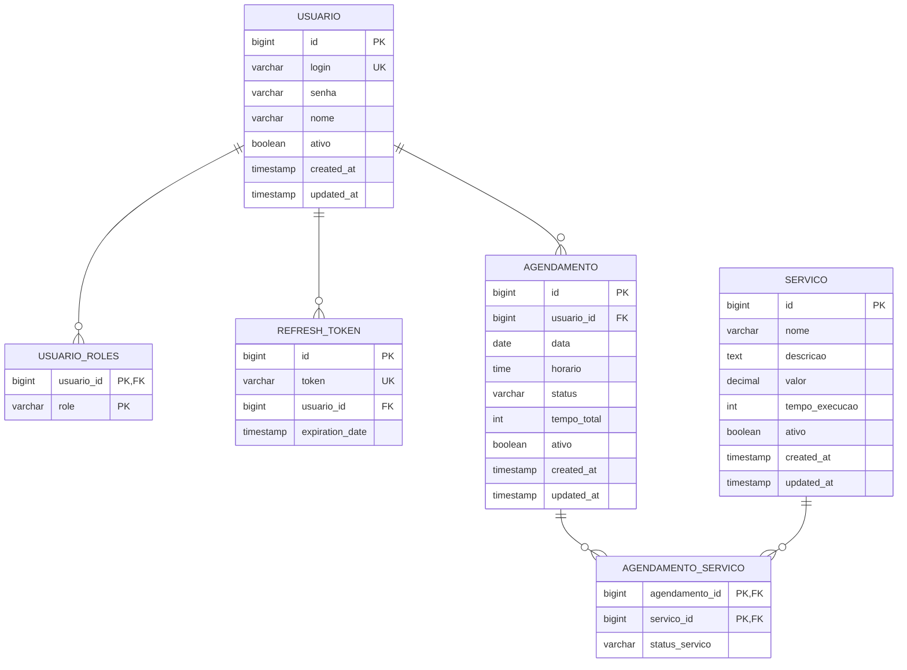

# Agendador de Serviços

Sistema de agendamento full-stack para gerenciamento de serviços com controle de acesso por papéis (RBAC).

## Stack Tecnológica

| Camada | Tecnologia |
|--------|------------|
| Backend | Java 21, Spring Boot 4.0 |
| Mobile | Flutter 3.11, Dart |
| Database | PostgreSQL 15 |
| Auth | JWT com refresh tokens |
| Migration | Flyway |

## Arquitetura

### Backend (Clean Architecture)
```
feature/
├── agendamento/     # Agendamento de serviços
├── auth/           # Autenticação JWT
├── servico/        # CRUD de serviços
└── usuario/        # Gestão de usuários
```
- **Use Cases**: Cada operação de negócio encapsulada em sua própria classe
- **Soft Delete**: Todos os registros usam `ativo` boolean
- **Auditoria**: Timestamps automáticos (createdAt, updatedAt)

### Mobile (Clean Architecture + BLoC)
```
lib/
├── core/           # DI, Network, Navigation, Theme
└── features/       # Auth, Agendamento, Home, Historico, Servico
```
- **State Management**: flutter_bloc
- **Dependency Injection**: get_it
- **Navigation**: go_router com guards

## Funcionalidades

### Usuário Comum
- Cadastro e login com JWT
- Visualizar serviços disponíveis
- Criar/editars/agendar horários
- Acompanhar status do agendamento (Pendente, Aprovado, Rejeitado)
- Ver histórico de agendamentos

### Administrador
- Aprovar/rejeitar agendamentos
- Gerenciar usuários (promover a admin)
- CRUD completo de serviços (nome, valor, duração)
- Dashboard com KPIs e gráficos
- Relatório semanal detalhado

## Segurança

- JWT com claims customizados (user_id, roles)
- Refresh tokens persistidos no banco
- BCrypt para senhas
- Endpoints públicos vs protegidos via Spring Security
- Admin auto-created no startup

## API (Swagger UI)

```
/swagger-ui.html
```

### Principais Endpoints

| Método | Endpoint | Descrição |
|--------|----------|-----------|
| POST | `/api/v1/auth/login` | Login |
| POST | `/api/v1/auth/refresh` | Renovar token |
| POST | `/api/v1/usuario` | Cadastro |
| GET/POST | `/api/v1/agendamento` | Listar/Criar |
| PATCH | `/api/v1/agendamento/{id}/aprovar` | Aprovar (admin) |
| GET | `/api/v1/agendamento/relatorio` | Dashboard (admin) |

## Diagrama de Entidade-Relacionamento



### Cardinalidade

| Relação | Tipo | Descrição |
|---------|------|-----------|
| Usuario → Role | 1:N | Um usuário pode ter múltiplos perfis (ADMIN, CLIENTE) |
| Usuario → Agendamento | 1:N | Um usuário pode ter múltiplos agendamentos |
| Agendamento → Servico | N:N | Um agendamento pode conter múltiplos serviços (via `agendamento_servico`) |
| Usuario → RefreshToken | 1:N | Um usuário pode ter múltiplos tokens de refresh |

### Índices (Migrations V4, V5)

| Tabela | Índice | Coluna |
|--------|--------|--------|
| agendamento | idx_agendamento_usuario | usuario_id |
| agendamento | idx_agendamento_data | data |
| agendamento_servico | idx_agendamento_servico_agendamento | agendamento_id |
| agendamento_servico | idx_agendamento_servico_servico | servico_id |
| refresh_token | idx_refresh_token_usuario | usuario_id |
| refresh_token | idx_refresh_token_token | token |

### Resumo das Tabelas

| Tabela | Descrição |
|--------|-----------|
| `usuario` | Usuários do sistema (clientes e admins) |
| `usuario_roles` | Perfis de cada usuário (tabela de junção N:N implícita com valor role) |
| `refresh_token` | Tokens JWT de renovação |
| `servico` | Serviços disponíveis para agendamento |
| `agendamento` | Agendamentos criados por usuários |
| `agendamento_servico` | Relação N:N entre agendamentos e serviços |

## Padrões Implementados

- **Soft Delete**: Exclusão lógica em todas entidades
- **Conflito de Horário**: Detecção e sugestão de alternativas
- **Restrição de Edição**: Agendamentos só editáveis 2 dias antes
- **Paginação**: Queries com pageable
- **Tratamento Global de Exceções**: Respostas padronizadas

## Pré-requisitos

| Ferramenta | Versão | Obrigatório |
|------------|--------|-------------|
| Java (JDK) | 21+ | Backend |
| Maven | 3.9+ | Backend |
| Docker | 24+ | Opcional (banco) |
| PostgreSQL | 15 | Produção |
| Flutter | 3.11.1+ | Mobile |
| Dart | 3.11+ | Mobile |
| Android SDK | - | Mobile (Android) |
| Xcode | 15+ | Mobile (iOS) |

### FVM (Flutter Version Management)

Se usar FVM, instale a versão configurada:
```bash
cd mobile
fvm install 3.11.1
fvm flutter pub get
fvm flutter run
```

## Executar

### 1. Banco de Dados

**Opção A - Docker (Recomendado para dev):**
```bash
docker-compose up db
```

**Opção B - PostgreSQL local:**
- Criar banco: `agendador_database`
- Usuário: `postgres` / Senha: `@Abc123`
- Porta: `5432`

### 2. Backend

**Desenvolvimento (H2 em memória):**
```bash
cd backend
./mvnw spring-boot:run
```
- API: http://localhost:8080
- Swagger: http://localhost:8080/swagger-ui.html
- H2 Console: http://localhost:8080/h2-console
  - JDBC URL: `jdbc:h2:mem:agendador`
  - User: `sa` / Senha: (vazia)

**Produção (PostgreSQL):**
```bash
docker-compose up db
./mvnw spring-boot:run -Dspring-boot.run.profiles=prod
```
Ou com variáveis de ambiente:
```bash
JWT_SECRET=sua-chave-secreta \
JWT_EXPIRATION=3600000 \
APP_ADMIN_LOGIN=admin \
APP_ADMIN_SENHA=sua_senha \
./mvnw spring-boot:run -Dspring-boot.run.profiles=prod
```

**Build Docker:**
```bash
cd backend
docker build -t agendador-backend .
docker run -p 8080:8080 --network host agendador-backend
```

### 3. Mobile

**1. Iniciar o Emulador Android:**
```bash
# Listar emuladores disponíveis
emulator -list-avds

# Iniciar um emulador
emulator -avd <nome_do_emulador>
```

**2. Rodar o projeto:**

O projeto tem flavors configurados: `dev` (para desenvolvimento local) e `prod`.

**Importante:** Use o flavor `dev` - ele tem a URL da API configurada para `http://10.0.2.2:8080` (Android Emulator → localhost).

```bash
cd mobile
flutter pub get
flutter run -d android --flavor dev -t lib/main_dev.dart
```

ou
```bash
flutter run --flavor dev lib/main_dev.dart
```

Ou com FVM:
```bash
cd mobile
fvm flutter pub get
fvm flutter run -d android --flavor dev -t lib/main_dev.dart
```
ou
```bash
fvm flutter run --flavor dev lib/main_dev.dart
```

**Build APK com flavor:**
```bash
flutter build apk --release --flavor dev -t lib/main_dev.dart
# ou
fvm flutter build apk --release --flavor dev -t lib/main_dev.dart
```

**Configuração de API:**
O app conecta em `http://localhost:8080`. Para Android/emulador, use `10.0.2.2:8080`.

**Build APK:**
```bash
flutter build apk --release
```

Ou com FVM:
```bash
fvm flutter build apk --release
```

**Build iOS (macOS):**
```bash
flutter build ios --release
```

Ou com FVM:
```bash
fvm flutter build ios --release
```

## Variáveis de Ambiente

### Backend

| Variável | Padrão | Descrição |
|----------|--------|-----------|
| `JWT_SECRET` | `chave-secreta-padrao...` | Chave para assinar JWT (mín. 256 bits) |
| `JWT_EXPIRATION` | `3600000` | TTL do token em ms (1 hora) |
| `APP_ADMIN_LOGIN` | `admin` | Login admin inicial |
| `APP_ADMIN_SENHA` | `admin123` | Senha admin inicial |
| `APP_ADMIN_NOME` | `Administrador` | Nome admin |

### Mobile

| Variável | Padrão | Descrição |
|----------|--------|-----------|
| `API_URL` | `http://10.0.2.2:8080` | URL da API (Android Emulator) |
| `API_URL` | `http://localhost:8080` | URL da API (iOS) |
